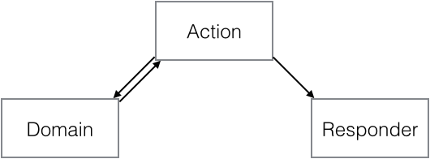

# Action-Domain-Responder

## Purpose

Organizes a single interaction between a web client and a web application into three distinct roles.



## Background

The term MVC has experienced some [semantic diffusion](http://martinfowler.com/bliki/SemanticDiffusion.html) from its original meaning, especially in a web context. (See [this video from Stefan Priebsch](http://vimeo.com/40968850) for a more extensive discussion.) To resolve this diffusion, the _Action-Domain-Responder_ pattern description is offered as a web-specific refinement of the MVC pattern.

I think ADR more closely fits what we actually do in web development on a daily basis. For example, this pattern is partly revealed by how we generally do web routing and dispatch. We generally route and dispatch *not* to a controller class per se, but to a particular action method within a controller class.

It is also partly revealed by the fact that we commonly think of the template as the _View_, when in a web context it may be more accurate to say that the HTTP response is the _View_.  As such, I think ADR may represent a better separation of concerns than MVC does in a web context.

## Components

_Action_ is the logic that connects the _Domain_ and _Responder_. It uses the request input to interact with the _Domain_, and passes the _Domain_ output to the _Responder_.

_Domain_ is the logic to manipulate the domain, session, application, and environment data, modifying state and persistence as needed.

_Responder_ is the logic to build an HTTP response or response description. It deals with body content, templates and views, headers and cookies, status codes, and so on.

## Collaborations

1. The web handler receives a client request and dispatches it to an _Action_.

1. The _Action_ interacts with the _Domain_.

1. The _Action_ feeds data to the _Responder_. (N.b.: This may include results from the _Domain_ interaction, data from the client request, and so on.)

1. The _Responder_ builds a response using the data fed to it by the _Action_.

1. The web handler sends the response back to the client.

## Comparison to MVC (Model-View-Controller)

The dominant pattern describing web interactions is _Model-View-Controller_. Is _Action-Domain-Responder_ really just _Model-View-Controller_ in drag?  We can see that the ADR terms map very neatly to MVC terms:

    Model      <--> Domain
    View       <--> Responder
    Controller <--> Action

The two seem very similar. How are they different?

Overall, we can see from Fowler in his [GUI Architectures](http://martinfowler.com/eaaDev/uiArchs.html) essay that "there's not just one view and controller, you have a view-controller pair for each element of the screen, each of the controls and the screen as a whole." This is the primary element of semantic diffusion when applying MVC to web applications.

Here are some more comparisons of the individual elements in MVC vs ADR.

### _Model_ vs _Domain_

I can think of no significant differences here, other than that the _Responder_ does not interact with the _Domain_ in meaningful ways. The _Responder_ might use _Domain_ objects like entities and collections, but only for presentation purposes; it does not modify the _Domain_ or feed information back to the _Domain_ as described under MVC.

### _Controller_ vs _Action_

In common usage, most _Controller_ classes in an MVC architecture contain several methods corresponding to different actions. Because these differing action methods reside in the same _Controller_, the _Controller_ ends up needing additional wrapper logic to deal with each method properly, such as pre- and post-action hooks.  A notable exception here is in micro-frameworks, where each _Controller_ is an individual closure or invokable object, mapping more closely to a single _Action_ (cf. [Slim](http://slimframeworkcom)).

In an ADR architecture, a single _Action_ is the main purpose of a class or closure. Each _Action_ would be represented by a individual class or closure.

The _Action_ interacts with the _Domain_ in the same way a _Controller_ interacts with a _Model_, but does not interact with a _View_ or template system. It sets data on the _Responder_ and hands over control to it.

### _View_ vs _Responder_

In an MVC architecture, a _Controller_ method will usually generate body content via a _View_ (e.g. a _Template View_ or a _Two Step View_). The _Controller_ then injects the generated body content into the response.  The _Controller_ action method will manipulate the response directly to set any needed headers.

Some _Controller_ action methods may present alternative content-types for the same domain data. Because these alternatives may not be consistent over all the different methods, this leads to the presentation logic being somewhat different in each method, each with its own preconditions.

In an ADR architecture, each _Action_ has a separate corresponding _Responder_. When the _Action_ is done with the _Domain_, it delivers any needed _Domain_ data to the _Responder_ and then hands off to the _Responder_ completely. The _Responder_ is entirely in charge of setting headers, picking content types, rendering templates, and so on.

Note that a _Responder_ may incorporate a _Template View_, _Two Step View_, _Transform View_, or any other kind of _View_ system. Note also that a generic _Responder_ may be used by more than one _Action_. The point is that the _Action_ leaves all header and content work to the _Responder_, not that there must be a different _Responder_ for each different _View_.

## Comparisons to Other Patterns

These are some of the other patterns that are generally seen as refinements of, replacements for, or complements to MVC. See also [the pattern discussion from Derek Greer at LosTechies](http://lostechies.com/derekgreer/2007/08/25/interactive-application-architecture/).

### EBI (Entity-Boundary-Interactor)

[EBI](http://www.whitewashing.de/2012/08/13/oop_business_applications_entity_boundary_interactor.html) appears to go by several synonyms: ports and adapters, hexagonal architecture, and [ECB](http://www.cs.sjsu.edu/~pearce/modules/patterns/enterprise/ecb/ecb.htm) (Entity-Control-Boundary). It is further described as part of a [Clean Architecture](http://blog.8thlight.com/uncle-bob/2012/08/13/the-clean-architecture.html) by Robert Martin.

EBI is in part an alternative to MVC where the core application elements and behaviors, represented by _Interactor_ and _Entity_ objects, are separated from the incoming and outgoing data streams by a _Boundary_. This has the effect of cleanly separating the application itself from the details of the input and output mechanisms, so that the core behaviors are never dependent on any particular element of the receiving and delivery systems. There is a great deal more to EBI architectures, such as "use cases" and "roles".

I confess to being unfamiliar with EBI, and so that description may be incorrect in whole or in part.  It occurs to me from my limited reading that EBI may better describe domain interactions rather than MVC architectural patterns. If the above description is accurate, it appears that ADR maps only roughly to EBI:

-  the ADR _Action_ and _Responder_ elements may represent a web-specific EBI _Boundary_

- the ADR _Domain_ element may represent an EBI _Interactor_ element, encapsulating or otherwise hiding the EBI _Entity_ elements from the ADR _Action_.

Alternatively, in ports-and-adapters or hexagonal architecture terms, it may be reasonable to think of the _Action_ as a "port" through which an EBI _Boundary_ is invoked as part of the ADR _Domain_. Finally, the _Responder_ could be seen as an "adapter" back through which the application data is returned.

Regardless, it does not appear that ADR is a direct replacement for EBI. It seems more likely that they are complements to each other.

### DCI (Data-Context-Interaction)

[DCI is described as a complement to MVC](https://en.wikipedia.org/wiki/Data,_Context,_and_Interaction), not a replacement for MVC. I think it is fair to call it a complement to ADR as well.

### MVP (Model-View-Presenter)

[MVP has been retired](http://www.martinfowler.com/eaaDev/ModelViewPresenter.html) in favor of [_Supervising Controller_](http://www.martinfowler.com/eaaDev/SupervisingPresenter.html) and [_Passive View_](http://www.martinfowler.com/eaaDev/PassiveScreen.html). At first this seems like a candidate match for ADR, especially in that the _Passive View_ and the _Model_ have no dependencies on each other as noted on the _Passive View_ page. From Fowler's narrative:

> Supervising Controller uses a controller both to handle input response but also to manipulate the view to handle more complex view logic ...
>
> A Passive View handles this by reducing the behavior of the UI components to the absolute minimum by using a controller that not just handles responses to user events, but also does all the updating of the view. This allows testing to be focused on the controller with little risk of problems in the view.

Let us examine a little more closely:

- _Model_ and the _Domain_ map closely, as they do in MVC.

- _Passive View_ does not map well to either _Action_ or _Responder_; it might better be regarded as the response that gets returned to the client.

- _Supervising Controller_ might map to _Responder_, in that it "manipulate[s] the view to handle more complex view logic". However, _Responder_ is not responsible for interacting with the _Domain_, and it does not receive the client input, so does not seem to be a good fit for _Supervising Controller_.

- Alternatively, _Supervising Controller_ might map to _Action_, but the _Action_ is not responsible for manipulating the view (i.e. the response).

In all, this seems a case of close-but-not-quite.

### MVVM (Model-View-ViewModel)

[MVVM](https://en.wikipedia.org/wiki/Model_View_ViewModel) seems to map only incompletely to ADR. The _Model_ in MVVM maps closely to the _Model_ in MVC and the _Domain_ in ADR. Similarly, the _View_ in MVVM maps closely to the _View_ in MVC and the _Responder_ in ADR.

However, the _ViewModel_ does not map well to a _Controller_ in MVC or an _Action_ in ADR. Because ADR is a refinement of MVC, it seems reasonable to think that comparisons between MVVM and MVC would apply equally well to ADR.

For an extended description of those differences, please see these articles from [Joel Wenzel](http://joel.inpointform.net/software-development/mvvm-vs-mvp-vs-mvc-the-differences-explained/), [Avtar Singh Sohi](http://www.codeproject.com/Articles/228214/Understanding-Basics-of-UI-Design-Pattern-MVC-MVP), [Rachel Appel](http://www.rachelappel.com/comparing-the-mvc-and-mvvm-patterns-along-with-their-respective-viewmodels), and [Niraj Bhatt](https://nirajrules.wordpress.com/2009/07/18/mvc-vs-mvp-vs-mvvm/).

(In email discussions with an interested party, I was informed that MVVM is just like MVC, but with an added _ViewModel_ to intermediate between the _View_ and _Model_. If this is true, then a _ViewModel_ is just as useful in ADR as it would be in MVC.)

### PAC (Presentation-Abstraction-Control)

[From Wikipedia](https://en.wikipedia.org/wiki/Presentation-abstraction-control):

> PAC is used as a hierarchical structure of agents, each consisting of a triad of presentation, abstraction and control parts. The agents (or triads) communicate with each other only through the control part of each triad. It also differs from MVC in that within each triad, it completely insulates the presentation (view in MVC) and the abstraction (model in MVC). This provides the option to separately multithread the model and view which can give the user experience of very short program start times, as the user interface (presentation) can be shown before the abstraction has fully initialized.

This does not seem to fit the description of ADR very well.

### RMR (Resource-Method-Representation)

I had not heard of [RMR](http://www.peej.co.uk/articles/rmr-architecture.html) before it was pointed out to me by [ircmaxell on Reddit](http://www.reddit.com/r/PHP/comments/24s8yn/actiondomainresponse_a_tentative_mvc_refinement/cha8jo1).

ADR and RMR seem very similar, and seem to map well to each other:

    Resource       <--> Domain
    Method         <--> Action
    Representation <--> Responder

However, some nuances of RMR make me think they are still somewhat different from each other. For example:

> So in an OO language, a HTTP resource can be thought of as an object with private member variables and a number of public methods that correspond to the standard HTTP methods. From an MVC point of view, a resource can be thought of as a model with a bit of controller thrown in.

To me, this seems like mixing concerns just a bit too much. I'd rather see a cleaner separation of the domain model from the action being applied to the domain.

> So the representation is like a view in MVC, we give it a resource object and tell it to serialize the data into it's output format.

There seems to be no allowance for other kinds of HTTP responses, such as "Not Found".  That kind of response is clearly not a representation of the requested resource.

Having said all that, it may be that ADR could be considered an expanded or superset variation of RMR, one where a _Resource_ and an action one can perform on it are cleanly separated into a _Domain_ and an _Action_, and where the _Representation_ (i.e., the building of the response) is handled by a _Responder_.

### Models-Operations-Views-Events (MOVE)

From [the originating site](http://cirw.in/blog/time-to-move-on):

> - Models encapsulate everything that your application knows.
> - Operations encapsulate everything that your application does.
> - Views mediate between your application and the user.
> - Events are used to join all these components together safely.

This is an interesting pattern in itelf. The idea of _Models_ and _Operations_ seems to map well to Domain-Driven Design idioms.

However, I do not think MOVE is a close fit for ADR, specifically because of this paragraph:

> Listening on events is what gives MOVE (and MVC) the inversion of control that you need to allow models to update views without the models being directly aware of which views they are updating.

In ADR, the _Domain_ and the _Responder_ do not "update each other". The _Domain_ work is completed and passed to the _Responder_ for it to present to the client.

### Separated Presentation

There are hints of ADR, espeically the _Responder_ element, in [Separated Presentation](http://martinfowler.com/eaaDev/SeparatedPresentation.html). Although the article is well worth reading, Separated Presentation sounds more like a meta-pattern that describes the general concern of separating data from presentation, not a specific approach to doing so.

## Examples of MVC vs ADR

### MVC Starting Point

An MVC directory structure for a naive blogging system might look like the following. Note that `index` and `read` present an alternative JSON type, and the comments template is a "partial" that also presents an alternative JSON type.

    controllers/
        BlogController.php # index(), create(), read(), update(), delete()
    models/
        BlogModel.php
    views/
        blog/
            index.html.php
            index.json.php
            create.html.php
            read.html.php
            read.json.php
            update.html.php
            delete.html.php
            _comments.html.php
            _comments.json.php

Here's another type of MVC directory structure:

    Blog/
        BlogController.php  # index(), create(), read(), update(), delete()
        BlogModel.php
        views/
            index.html.php
            index.json.php
            create.html.php
            read.html.php
            read.json.php
            update.html.php
            delete.html.php
            _comments.html.php
            _comments.json.php

A typical _Controller_ class in MVC might look something like the following. Note that there are multiple actions within the _Controller_ class, and that
the action method deals with the response headers.

```php
<?php
use Framework\Controller;

class BlogController extends Controller
{
    public function create()
    {
        // is this a POST request?
        if ($this->request->isPost()) {

            // retain incoming data
            $data = $this->request->getPost('blog');

            // create a blog post instance
            $blog = $this->blog_model->newInstance($data);

            // is the new instance valid?
            if ($blog->isValid()) {
                // yes, save and redirect to editing
                $blog->save();
                $this->response->redirect('/blog/edit/{$blog->id}');
                return;
            } else {
                // no, show the "create" form with the blog instance
                $this->response->setContent($this->view->render(
                    'create.html.php',
                    array('blog' => $blog),
                ));
                return;
            }
        } else {
            // not a POST request, show the "create" form with defaults
            $this->response->setContent($this->view->render(
                'create.html.php',
                array('blog' => $this->blog_model->getDefault())
            ));
        }
    }

    public function index()
    {
        // ...
    }

    public function read($id)
    {
        // ...
    }

    public function update($id)
    {
        // ...
    }

    public function delete($id)
    {
        // ...
    }
}
?>
```

The `create()` logic could be reduced somewhat by moving even more of the model interactions into a _Service Layer_, but the point remains that the _Controller_ typically sets the response headers and content.

### ADR Revision

In comparison, an ADR directory structure might instead look like this. Note how each _Action_ has a corresponding _Responder_.

    Blog/
        Action/
            BlogIndexAction.php
            BlogCreateAction.php
            BlogReadAction.php
            BlogUpdateAction.php
            BlogDeleteAction.php
        Domain/
            # Model, Gateway, Mapper, Entity, Collection, Service, etc.
        Responder/
            BlogIndexResponder.php
            BlogCreateResponder.php
            BlogReadResponder.php
            BlogUpdateResponder.php
            BlogDeleteResponder.php
            html/
                index.html.php
                create.html.php
                read.html.php
                update.html.php
                delete.html.php
                _comments.html.php
            json/
                index.json.php
                read.json.php
                _comments.json.php

The _Action_ and _Responder_ class pair corresponding to the above _Controller_ `create()` example might look like this:

```php
<?php
use Framework\Action;

class BlogCreateAction extends Action
{
    public function __invoke()
    {
        // is this a POST request?
        if ($this->request->isPost()) {

            // yes, retain incoming data
            $data = $this->request->getPost('blog');

            // create a blog post instance
            $blog = $this->blog_model->newInstance($data);

            // is the new instance valid?
            if ($blog->isValid()) {
                $blog->save();
            }

        } else {
            // not a POST request, use default values
            $blog = $this->blog_model->getDefault();
        }

        // set data into the response
        $this->responder->setData(array('blog' => $blog));
        $this->responder->__invoke();
    }
}
?>
```

```php
<?php
use Framework\Responder;

class BlogCreateResponder extends Responder
{
    // $this->response is the actual response object, or a response descriptor
    // $this->view is a view or template system
    public function __invoke()
    {
        // is there an ID on the blog instance?
        if ($this->data->blog->id) {
            // yes, which means it was saved already.
            // redirect to editing.
            $this->response->setRedirect('/blog/edit/{$blog->id}');
        } else {
            // no, which means it has not been saved yet.
            // show the creation form with the current response data.
            $this->response->setContent($this->view->render(
                'create.html.php',
                $this->data
            ));
        }
    }
}
?>
```

Again, we can see numerous refactoring opportunities here, especially in the domain model work. The point is that the _Action_ does not perform any  _Responder_ work at all. That work is handled entirely by the _Responder_ logic.

You can review an extended set of sample ADR code [here](https://github.com/pmjones/adr/blob/master/example-code).

## Commentary

### Request Omission

A common critique so far has been that there is no "HTTP request" element present in the pattern.  An earlier version of this document included a request under the title "Request-Action-Domain-Response". However, on further research into MVC and other related architectural patterns, I noticed that none of them define an input element. To stay in line with precedent, this pattern omits the incoming HTTP request.

### Front Controller Omission

This pattern concentrates on the refinement of _Model-View-Controller_, and not on the entirety of web applications. Therefore, it intentionally omits some elements commonly found in web applications, particularly anything related to a _Front Controller_.

The ADR pattern does not describe a routing or dispatching element, nor how the _Action_ and _Responder_ relate to a dispatcher. Routing and dispatching are more properly the purview of _Front Controller_, and there are many ways for the _Action_, _Responder_, and any _Front Controller_ mechanism to interact:

- the _Action_ may invoke the _Responder_ directly, which then returns a response;

- the _Responder_ and response may be shared with a _Front Controller_ so that it can invoke them directly;

- the _Action_ may return a _Responder_, which is then invoked to return a response, which is then invoked to send itself;

- and so on.

The ADR pattern does not describe any pre-filter or request-validation elements, especially those that may be part of a _Front Controller_. Note that pre-filter or request-validation logic may or may not bypass the _Action_ to invoke the _Responder_ directly, or it may deliver a response of its own, or it may invoke a separate _Action_ as a result of its logic, and so on. Likewise, the invoked _Action_ may have its own set of pre-condition checks that cause it to invoke the _Responder_ without ever interacting with the _Domain_. Reasons for these short-circuiting behaviors may include:

- HTTP method negotiation. If the routing system does not map the requested HTTP method to the requested _Action_, the _Front Controller_ may return an error response instead of dispatching to the requested _Action_.

- Authentication. The presence or absence of client credentials, and their validity, may curtail the need to dispatch to an _Action_ in the first place, or to interact with the _Domain_ while in an _Action_.

- Authorization. Access-control systems may deny the client's request for the given _Action_, or cause the _Action_ to bypass interactions with _Domain_, and possibly return a response of their own.

- Content negotiation. The _Front Controller_, _Action_, or other intermediary layers may negotiate the various `Accept` headers in the client request. Unsuccessful negotiation may pre-empt _Action_ or _Domain_ behaviors, and/or result in an early-exit response.

- Content validation. If the incoming request data is malformed in some way, the _Action_ might not interact with the _Domain_ at all and move directly to interacting with a _Responder_ to send an error response.

### Alternative Formulations

This pattern may be better formulated as variations on _Controller_ and _View_ from _Model-View-Controller_ instead of a pattern of its own.

That is, it may be that _Action_ is a variation similar to _Page Controller_, and thus better termed an _Action Controller_. It would thereby fit into the _Controller_ portion of MVC.  (Indeed, the formal description for _Page Controller_ says that it represents a "page or action.")

Likewise, it may be that _Responder_ is a variation similar to _Template View_ or _Transform View_, and thus better termed a _Response View_. It would thereby fit into the _View_ portion of MVC.

Having said that, I believe those alternative formulations are probably not as good of a description of web-based interactions as is ADR. This is mostly because of the implicit interactions between _Model_ and _View_ in MVC.  In MVC, the _View_ updates the _Model_. In ADR, the _Responder_ does not update the _Domain_.

### Ambiguous Domain

_Domain_ covers a lot: not just the business domain, but environment and application state as well. It might be better to call this a _Model_, but that too is somewhat ambiguous.

Additionally, it may be that the _Action_ should pass a [_Presentation Model_](http://martinfowler.com/eaaDev/PresentationModel.html) to the _Responder_ instead of _Domain_ data. But then, maybe the _Domain_ service layer used by the _Action_ returns a _Presentation Model_ that encapsulates application state.

Regardless, recall that ADR is presented as a refinement to MVC. Thus, ADR has only as much to say about the _Domain_ as MVC has to say about the _Model_.

### Expanding Actions

One commenter noted that the _Action_ element might be interpreted to allow for different logic based on the incoming request. For example, he noted that readers might expand a single _Action_ to cover different HTTP methods, and put the logic for the different HTTP methods into the same _Action_.

While I believe the pattern implies that each _Action_ should do only one thing, that implication rising from the [_Controller_ vs _Action_](#controller-vs-action) and [RMR vs ADR](#rmr-resource-method-representation) comparisons, I will state it more explicitly here: the idea is that each _Action_ should express one, and only one, action in response to the incoming request.

### A Replacement For, Not Refinement Of, MVC

Nate Abele opines that the ADR pattern should be a *replacement* for MVC, one that applies to server-side applications:

> I will say that the more I learn about MVC, the more I think it has little to nothing to do with server-side web applications. ... I think the biggest upshot of your ADR idea is that it provides us a clean break from what I have come to understand is a bad abstraction. My advice would be to avoid defining ADR in terms of MVC except where absolutely necessary.

Via <http://paul-m-jones.com/archives/5993#comment-42425>.

### Other Commentary

The original blog post that led to this offering is at <http://paul-m-jones.com/archives/5970>.

Stephan Hochdörfer responded to that offering at <http://blog.bitexpert.de/blog/controller-classes-vs.-action-classes>; follow-up discussion appears at <http://paul-m-jones.com/archives/5987> and <http://www.reddit.com/r/PHP/comments/25y89a/stephan_hochdörfer_and_actiondomainresponder>.

Jon Leighton writes about a "Focused Controller" that maps well to the _Action_ element in ADR at <http://www.jonathanleighton.com/articles/2012/explaining-focused-controller>.

A follow-up post regarding _View_ vs _Responder_ is at <http://paul-m-jones.com/archives/5993> with Reddit commentary at <http://www.reddit.com/r/PHP/comments/26j3nf/the_template_is_not_the_view/> and <http://www.reddit.com/r/webdev/comments/26j5o9/the_template_is_not_the_view_xpost_from_rphp/>.

Akihito Koritama offers these notes: <https://koriym.github.io/blog/2014/06/08/action-domain-responder/>

## Benefits and Drawbacks

One benefit overall is that the pattern more closely describes the day-to-day work of web interactions. A request comes in and gets dispatched to an action; the action interacts with the domain, and then builds a response. The response work, including both headers and content, is cleanly separated from the action work.

One drawback is that we end up with more classes in the application. Not only does each _Action_ go in its own class, each _Responder_ also goes in its own class.

This drawback may not be so terrible in the longer term. Individual classes may lead to cleaner or shallower inheritance hierachies. It may also lead to better testability of the _Action_ separate from the _Responder_. These will play themselves out differently in different systems.  Others have noted that "many classes" may be more easily manageable via IDEs and editors than "fewer classes but more methods" since class lookups are frequently easier than method lookups.

## Acknowledgements

My thanks to the many people who have helped refine this offering, whether through questions, comments, criticism, or commendation. In no particular order, these include:

- Matthew Weier O'Phinney
- Hari KT
- Stephan Hochdörfer
- Adam Culp
- Dan Horrigan
- Josh Lockhart
- Beau Simensen
